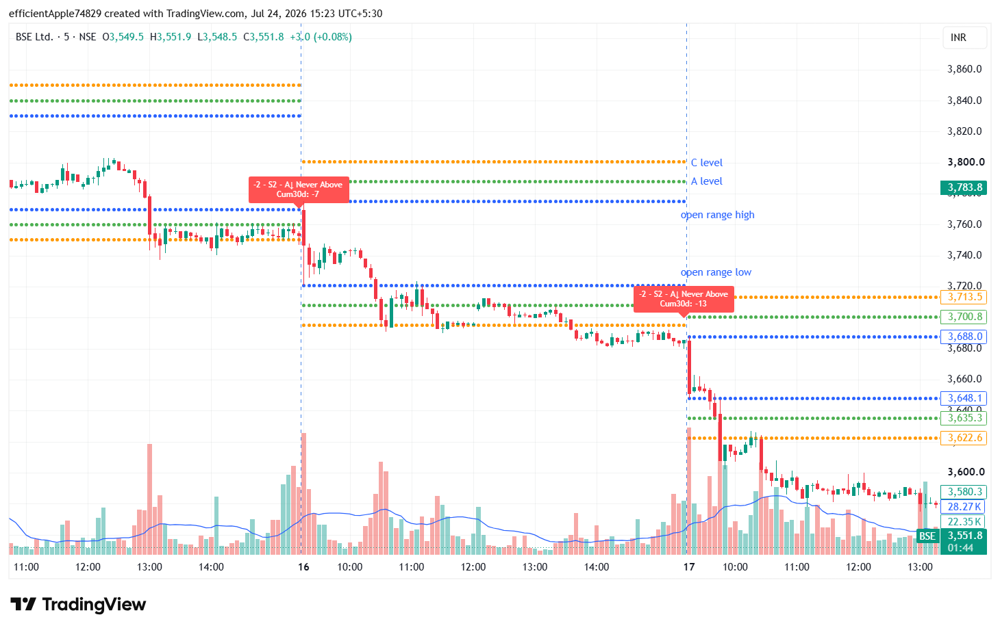
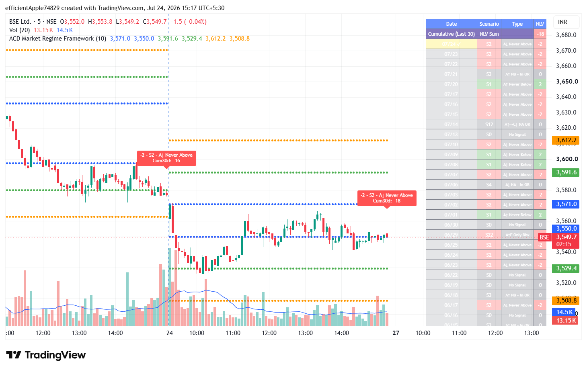
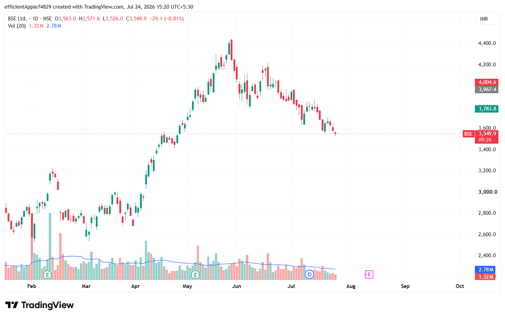
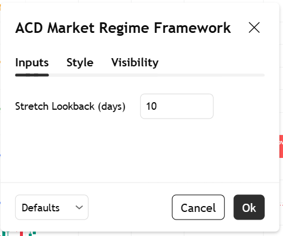

# ACD Market Regime Framework

A TradingView Pine Script indicator for long-term market regime analysis using ACD-style intraday scenario classification, stretch-based A/C levels, and rolling 30-day cumulative scoring.

## Overview

ACD Market Regime Framework is designed to convert intraday market behavior into a structured long-term regime signal. The script tracks opening-range behavior, derives stretch-based A and C levels, classifies each completed session into one of 26 predefined scenarios, assigns a directional macro value, and maintains a rolling 30-day cumulative score for higher-level trade filtering.

This framework is intended for traders and investors who want to use daily market structure as a long-term decision-support input. A practical use case is monitoring the cumulative 30-day value and taking trades only when that broader regime measure moves beyond threshold levels such as +9 or -9.

## Features

- Daily Opening Range construction from the first intraday bar.
- Stretch10-based A-up, A-down, C-up, and C-down level calculation.
- Intraday confirmation logic for A and C transitions.
- Scenario classification across 26 session types (S1-S26).
- Directional macro scoring for each completed session.
- Rolling 30-day cumulative macro tracking.
- On-chart labels for daily scenario output and cumulative value.
- Summary table showing recent session classifications and macro scores.
- Long-term regime filtering for directional trade selection.

## Screenshots

### Chart Overview
Displays the full indicator layout, including the Opening Range, A/C levels, daily scenario label, and current session structure.

### Label Output
Displays the scenario label with macro value, scenario code, scenario description, and rolling 30-day cumulative score.

### Regime Setup Example
Displays an example of how the framework identifies and summarizes a completed market regime session.

### Settings Tool Box
Displays the indicator settings panel, including the Stretch Lookback input used in daily level calculations.

## How It Works

The framework follows a session-based process:

1. Pulls prior completed daily data to calculate and lock the session Stretch10 value.
2. Uses the first intraday bar to define the Opening Range high and low.
3. Builds A-up, A-down, C-up, and C-down levels from the Opening Range and locked stretch value.
4. Tracks intraday level touches, confirmations, reversals, and failed transitions.
5. Maps completed session behavior into one of 26 predefined scenarios.
6. Assigns a macro value to the scenario and adds it to the rolling 30-day cumulative score.
7. Displays both the individual session result and the broader regime context directly on the chart.

## Scenario Model

Each completed session is classified into one of 26 scenario types labeled S1 through S26. These scenarios capture different combinations of A-level confirmations, C-level continuations, failed moves, reversals, and closing position relative to the Opening Range.

Each scenario is mapped to a macro score that can be positive, negative, or neutral. The rolling sum of recent macro values is then used as the broader regime signal for long-term decision support.

## Inputs

The indicator includes the following setting:

- **Stretch Lookback (days)** — controls the number of daily periods used in the Stretch10 calculation.

## Usage

1. Open TradingView.
2. Open Pine Editor.
3. Copy the script from `acd-market-regime-framework.pine`.
4. Paste it into Pine Editor.
5. Save the script and add it to the chart.
6. Review the daily label, scenario classification, and Cum30d value after session development.
7. Use the cumulative regime signal as a higher-level filter for long-term trade selection.

## Technical Approach

- Intraday market structure analysis.
- ACD-style scenario logic.
- Time-series state tracking.
- Rolling cumulative macro scoring.
- Real-time visualization with labels and tables in TradingView.

## Notes

This project is intended for educational and analytical purposes. It does not provide financial advice, guaranteed entries, or assured performance in live markets.

## License

This project is licensed under the MIT License.
